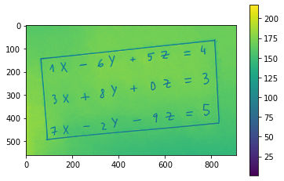
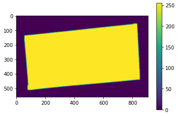
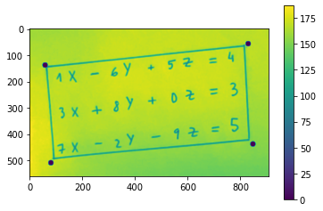
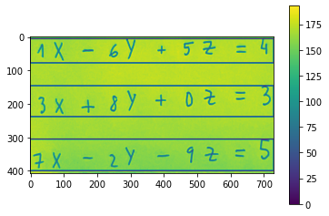
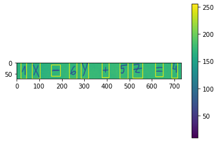
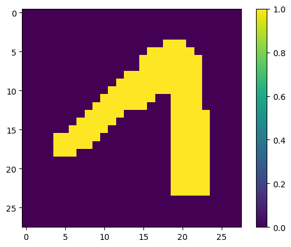
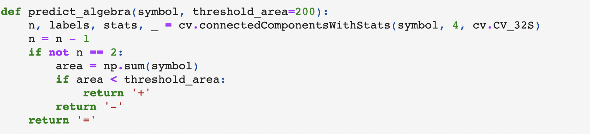
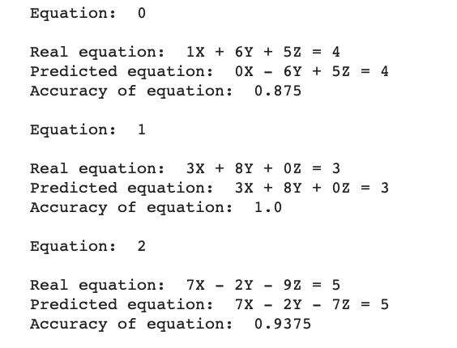

# Computer Vision Calculator

Using the MNIST dataset for the digits model, and the letter data set: https://www.kaggle.com/datasets/sachinpatel21/az-handwritten-alphabets-in-csv-format for the letter model, train my own implementation of a deep neural network to recognize the single elements of a system of linear equations to solve it. 

## 1. Requirements

In order for this application to work, the photo must have the next **format**: 

1. A big square / rectangle must surround the equations. 
2. The equations have to be visually separated from one another. 
3. The characters from each equation have to be visually separated from one another. 
4. The format of the equations must be: number, letter, algebraic symbol. Even if the number is a 0. 

## 2. Process

Using the `data/perspective.py` file, we want to get the block equation in order to identify the character's equations. 
Here is the process: 

### 2.1 Segmentation of the block

Using some computer vision techniques (such as Otsu segmenation, dilation and erosion) we get the area in which the equations are written. That is why the equations have to be surrounded by a big box. 

### 2.2 Vertices

If the image is rotated, we need to obtain the vertices of the big box to tranform the perspective: 

### 2.3 Getting the individual equations

Using only erosion and dilation over the area we got in the section 2.1, we obtain the individual equations: 

### 2.4 Single Characters

Once we have each equation (and its correspondent coordinates), we can again apply erosion and dilation over that equation's area to obtain the single characters that then will be fed to the neural network: 

## 3. Prediction

Once we have the window in which the single characters are in one equation, we have to format this images so we can feed them to the different neural networks models in order to make predictions. Both the MNIST digits and the letter digits are images with shape: (28, 28)
whose pixels take values: [0, 1]. In order to get a nice figure of the single characters we will apply: 

1. Bounding box. To center the digits. 
2. Padding. To have some margin on the bordes of the digits. 
3. Bool values. The  pixels of the pad image can only take values of 0 or 1. 

The result of this process: 

If we look at the image of the 2.4 Section we can a see a huge difference between the number 1 detected on that image and the processed one. 
This is the image we will fed into our models. The same applies to the letter images. 

### 3.1 Algebraic predictions

In order to make predictions over the algebraic symbols, we make a function that computes the number of components an image has.

1. Equal sign. The number of labels (without considering the background) is 2. 
2. Plus sign and minus sing. The number of labels (without considering the background) is 1. Because of the preprocess of the images to make them have the correct format so we can feed them to the models, the plus sign will maintain its original form, whereas the minus sign will be much bigger. That is why we define a threshold area to distinguish one from another. 

## 4. Results

Even though the results are not very accurate for a task like this (with a `Bayes Error` of approximately 0 %), we can extract some conclusions: 

1. The clarity of the single elements is fundamental in order to predict correctly. The MNIST dataset is one of the cleanest datasets out there and the characters we get from each equation are not from the same distribution. 

2. Our models work so the only thing we need to be worried about is to get data from the same distribution. 

3. The letter model works perfectly. It has a simple explanation: since we knew beforehand that the system of linear equations would be of 3 equations (3 not known variables), we do not need to train the neural network over the hole alphabet dataset, only in the letters that appear in our equations. If the sytem has 6 different letters, the neural network should be trained on those letters to improve efficiency and accuracy. 
